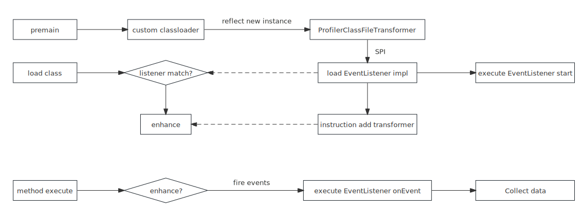
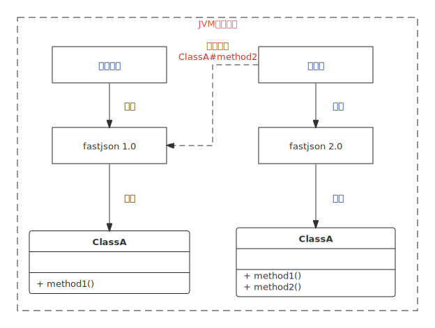
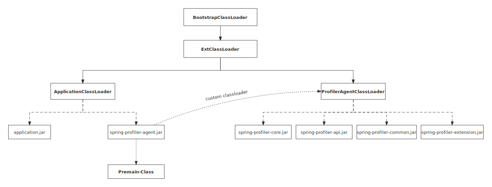
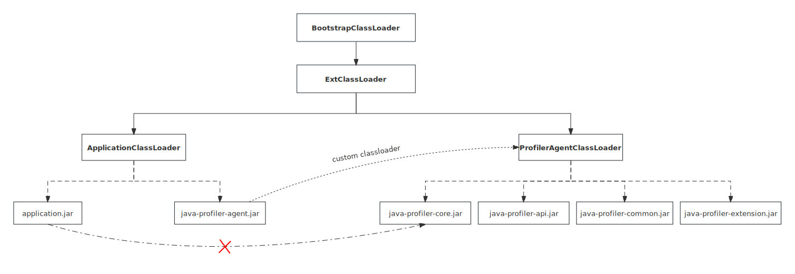
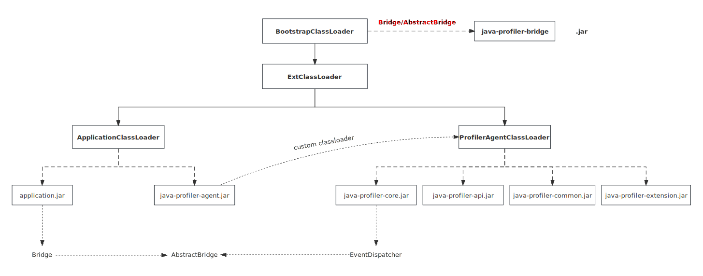

# 应用启动数据采集原理

刚开始的时候，只想做Spring bean加载耗时timeline可视化分析，实现了一个简单的版本[spring-bean-timeline](https://github.com/linyimin0812/spring-bean-timeline)，但是随着需求的增多，直接和应用源码耦合的方式不再适用，容易产生依赖冲突。于是开始引入java agent技术。

java agent是一种代理技术，通过jvm的Instrumentation api实现，这个api提供了在jvm加载类之前或之后修改字节码的能力。通常被用于java应用程序的监控、诊断、性能分析、代码注入等。java agent提供了两个入口点：`premain`和`main`方法。其中`premain`方法可以实现**在java应用程序的类被加载之前对它们进行转换**。

要观测应用启动过程，需要在应用类被加载之前对其进行增强，然后加载增强后的类。所以选择了java agent的`premain`实现。由于通过asm进行字节码增强细节太多，又不好理解，所以选择了[ByteKit](https://github.com/alibaba/bytekit)进行字节码增强，ByteKit一个基于ASM提供更高层的字节码处理能力，主要面向诊断/APM领域的字节码库，提供了一套简洁的API，开发人员可以轻松的完成字节码增强。

其他实现主要参考了[jvm-sandbox](https://github.com/alibaba/jvm-sandbox)和[arthas](https://github.com/alibaba/arthas)的实现。



## 类/方法增强策略

增强类`ProfilerClassFileTransformer`是接口`ClassFileTransformer`的实现类，其`transform`方法会在类被加载到jvm之前执行，所以在这个方法中实现对指定类的增强。

参考jvm-sandbox的思想：任何一个Java方法的调用都可以分解为BEFORE、RETURN和THROWS三个环节，由此在三个环节上引申出对应环节的事件探测和流程控制机制。结合ByteKit提供的API对这三个环节进行增强即可。

```java
// BEFORE
try {

   /*
    * do something...
    */

    // RETURN
    return;

} catch (Throwable cause) {
    // THROWS
}
```

```java
public class Interceptor {

    // BEFORE
    @AtEnter
    public static void atEnter(@Binding.Class Class<?> clazz,
                               @Binding.This Object target,
                               @Binding.MethodName String methodName,
                               @Binding.MethodDesc String methodDesc,
                               @Binding.Args Object[] args) {
        Bridge.atEnter(clazz, target, methodName, methodDesc, args);
    }

    // RETURN
    @AtExit
    public static void atExit(@Binding.Class Class<?> clazz,
                              @Binding.This Object target,
                              @Binding.MethodName String methodName,
                              @Binding.MethodDesc String methodDesc,
                              @Binding.Args Object[] args,
                              @Binding.Return Object returnObj) {
        Bridge.atExit(clazz, target, methodName, methodDesc, args, returnObj);
    }

    // THROWS
    @AtExceptionExit
    public static void atExceptionExit(@Binding.Class Class<?> clazz,
                                       @Binding.This Object target,
                                       @Binding.MethodName String methodName,
                                       @Binding.MethodDesc String methodDesc,
                                       @Binding.Args Object[] args,
                                       @Binding.Throwable Throwable throwable) {
        Bridge.atExceptionExit(clazz, target, methodName, methodDesc, args, throwable);
    }
}
```


如何判断enter方法和exit方法属于同一个增强方法？

方法的调用是栈结构，要判断enter方法和exit方法属于同一个增强方法，可以通过引入一个栈`Deque<Long> stack = new LinkedList<>()`实现。每次调用enter方法时，往栈中压入一个递增id表示invokeId，执行到exit方法时弹出，如果invokeId一样说明属于同一个增强方法。

为了支持多线程环境，使用ThreadLocal变量进行修饰即可：ThreadLocal<InvokeStack> invokeRef = ThreadLocal.withInitial(InvokeStack::new);

## 类隔离策略

随着本项目能力的增多，所依赖的三方包数量也在增加，容易与应用产生依赖冲突，导致应用启动失败或运行时异常。



例如：应用和本项目同时依赖了fastjson。其中应用依赖fastjson1的classA#method1，本项目依赖fastjson2中的classA#method2。

JVM加载Class时，由于类加载器的实现对于jar路径没有顺序要求，可能加载fastjson1中的ClassA，这样本项目在调用classA#method2时，就会产生NoSuchMethodError。

### 自定义类加载器实现隔离

为了避免本项目(spring-startup-analyzer)代码对应用的影响，项目进行了代码隔离。在JVM中一个类型实例是通过类加载器+全类名确定的也就是说为了避免不同模块代码间相互影响(两个jar中可能会存在全类名相同，但是逻辑完全不同的类)，可以通过使用不同的ClassLoader进行加载来实现隔离。如arthas、tomcat等都是基于ClassLoader实现代码隔离的，本项目参考了arthas类隔离的实现，也是通过定义了自己的ClassLoader——[ProfilerAgentClassLoader](https://github.com/linyimin0812/spring-startup-analyzer/blob/main/spring-profiler-agent/src/main/java/io/github/linyimin0812/agent/ProfilerAgentClassLoader.java)来实现与应用代码隔离的。

> 类加载原则：**加载当前类的加载器，也会用于加载其所依赖的类(当然不一定是此类加载器加载，也可能是遵循双亲委派原则，由双亲加载器加载**)

因为Premain-Class——`ProfilerAgentBoostrap`的premain方法是agent的入口方法，启动时由应用JVM加载，一般是ApplicationClassLoader加载器加载。按照上述类加载器的原则，本项目的代码也都会由应用的ApplicationClassLoader加载，无法实现代码隔离。要想实现代码隔离，就要打破上面的类加载原则。

因为Premain-Class类的pre-main方法是agent的入口方法，一定会由应用类加载器加载。所以讲Premain-Class和自定义类加载器放到一个单独的jar包——[spring-profiler-agent](https://github.com/linyimin0812/spring-startup-analyzer/tree/main/spring-profiler-agent)中，由应用类加载器加载，而项目的核心逻辑放到其他jar包当中，由自定义类加载器加载，这样就可以实现应用代码与本项目代码的隔离。



```java
agentLoader = createAgentClassLoader();
Class<?> transFormer = agentLoader.loadClass("io.github.linyimin0812.profiler.core.enhance.ProfilerClassFileTransformer");
Constructor<?> constructor = transFormer.getConstructor(Instrumentation.class, List.class);
Object instance = constructor.newInstance(instrumentation, getManifests());
```

1. 首先通过`ProfilerAgentClassLoader`加载[spring-profiler-core](https://github.com/linyimin0812/spring-startup-analyzer/tree/main/spring-profiler-core)的初始化类`ProfilerClassFileTransformer`;
2. 通过反射调用的方式进行实例化实现本项目的初始化。

因为`ProfilerClassFileTransformer`是由`ProfilerAgentClassLoader`加载器加载的，`ProfilerClassFileTransformer`负责初始化`spring-profiler-core`，按照加载当前类的加载器，也会用于加载其所依赖的类原则，`ProfilerClassFileTransformer`依赖的类也会由`ProfilerAgentClassLoader`加载，所以就是实现了本项目与应用的隔离。

注意：不能将反射调用结果强制转换成`ProfilerClassFileTransformer`，不然会抛ClassCastException。因为左边`ProfilerClassFileTransformer`的类型实例是由应用的ApplicationClassLoader加载的，而右边的`ProfilerClassFileTransformer`的类型实例是由`ProfilerAgentClassLoader`加载的，class实例不同不能进行转换。

**NO:**

```java
Class<ProfilerClassFileTransformer> transFormer = agentLoader.loadClass("io.github.linyimin0812.profiler.core.enhance.ProfilerClassFileTransformer");
Constructor<ProfilerClassFileTransformer> constructor = transFormer.getConstructor(Instrumentation.class, List.class);
ProfilerClassFileTransformer instance = constructor.newInstance(instrumentation, getManifests());

```

### 应用代码调用本项目代码

根据类加载器的双亲委派原则，**父类加载器加载的类对子类加载器是可见的**，而子类加载器加载的类对父类加载器是不可见的，**兄弟类加载器加载的类互相是不可见的**。也就是说本项目和应用JVM之间共享了JMX等底层API(由BootstrapClassLoader和ExtClassLoader加载的类)，所以本项目可以通过调用JDK的一些API获取应用JVM相应的运行时数据。但是本项目会往应用方法中注入一些代码进行增强，但是由于ApplicationClassLoader和ProfilerAgentClassLoader加载器的类之间是不可见的，也就是说应用代码是不能直接调用本项目中代码的，会有ClassNotFoundException或者ClassCastException。



本项目采用了Arthas中的方案，引入了一个[spring-profiler-bridge](https://github.com/linyimin0812/spring-startup-analyzer/tree/main/spring-profiler-bridge)模块，相当与在应用和本项目之间架起了一座桥梁。此模块中只有一个`Bridge`类文件，由BoostrapClassLoader加载，所以Bridge对于ApplicationClassLoader和ProfilerAgentClassLoader都是可见的，应用通过Bridge实现对本项目的调用，从而实现功能的增强。

```java
File spyJarFile = new File(LIB_HOME + BRIDGE_JAR);
instrumentation.appendToBootstrapClassLoaderSearch(new JarFile(spyJarFile));
```

1. 将spring-profiler-bridge.jar添加到应用的BootstrapClassLoader的搜索路径中
2. 按照类加载的双亲委派原则，加载Bridge类时，会优先委托给BootstrapClassLoader，所以Bridge会被根类加载器加载，而不是本项目中自定义的ProfilerAgentClassLoader加载


Bridge类中定义了不同时机的静态增强处理函数，具体的处理逻辑由抽象类AbstractBridge的子类[EventDispatcher](https://github.com/linyimin0812/spring-startup-analyzer/blob/main/spring-profiler-core/src/main/java/io/github/linyimin0812/profiler/core/enhance/EventDispatcher.java)实现。


因为AbstractBridge是Bridge的内部静态类，在Bridge中定义了一个静态属性，所以AbstractBridge也会由BoostrapClassLoader加载。而EventDispatcher在spring-profiler-core模块中实现，所以会被本项目自定义类加载器ProfilerAgentClassLoader加载。

所以本项目可以通过调用Bridge的setBridge方法设置增强代码的具体执行逻辑。因为AbstractBridge由BoostrapClassLoader加载，EventDispatcher由ProfilerAgentClassLoader加载，所以EventDispatcher的实例可以向上类型转换成AbstractBridge实例，完成赋值操作。

应用代码在调用本项目的增强代码时，是通过调用Bridge的静态方法，然后调用AbstractBridge实例实现方法增强。




# 应用启动加速原理

## Spring Bean异步加载原理

Spring在启动过程中对于Bean的加载是顺序进行的，如果存在部分Bean加载耗时比较严重时，应用的启动时长会被严重拉长。Bean的加载耗时主要在`init-method`方法或`@PostConstruct`标识的方法，容器中的Bean多数不存在依赖关系，如果可以将Bean的初始化方法异步化，可以大大降低启动耗时。

主要依赖Spring提供一个`BeanPostProcessor`扩展点实现。`BeanPostProcessor`允许我们自定义bean的实例化和初始化过程。它是一个接口，定义了两个方法：

> `postProcessBeforeInitialization(Object bean, String beanName)`：在bean初始化之前调用该方法,可以在初始化之前对bean对象进行任何自定义的修改或增强。
`postProcessAfterInitialization(Object bean, String beanName)`：在bean初始化之后调用该方法。可以在bean初始化后对其进行任何自定义的修改或增强。


方法：

1. 实现`BeanPostProcessor`扩展点

- 在`postProcessBeforeInitialization`中判断beanName是否是配置异步初始化Bean
- 如果需要异步化，查找`init-method`或者`@PostConstruct`修饰的方法
- 动态代理初始化方法，将初始化方法扔到线程池中执行，并返回Future

```java
public class AsyncProxyBeanPostProcessor implements BeanPostProcessor {


    @Override
    public Object postProcessBeforeInitialization(Object bean, String beanName) throws BeansException {

        if (!beanFactory.containsBeanDefinition(beanName)) {
            return bean;
        }

        String methodName = AsyncInitBeanFinder.getAsyncInitMethodName(beanName, beanFactory.getBeanDefinition(beanName));

        ProxyFactory proxyFactory = new ProxyFactory();
        proxyFactory.setTargetClass(bean.getClass());
        proxyFactory.setProxyTargetClass(true);

        AsyncInitializeBeanMethodInvoker invoker = new AsyncInitializeBeanMethodInvoker(bean, beanName, methodName);

        proxyFactory.addAdvice(invoker);

        return proxyFactory.getProxy();

    }

    class AsyncInitializeBeanMethodInvoker implements MethodInterceptor {

        @Override
        public Object invoke(MethodInvocation invocation) throws Throwable {
            if (AsyncTaskExecutor.isFinished()) {
                return invocation.getMethod().invoke(targetObject, invocation.getArguments());
            }

            Method method = invocation.getMethod();
            String methodName = method.getName();

            if (this.asyncMethodName.equals(methodName)) {
                logger.info("async-init-bean, beanName: {}, async init method: {}", beanName, asyncMethodName);
                AsyncTaskExecutor.submitTask(() -> {
                    invocation.getMethod().invoke(targetObject, invocation.getArguments());
                });

                return null;
            }

            return invocation.getMethod().invoke(targetObject, invocation.getArguments());
        }
    }
}
```

2. 实现ApplicationListener

- 监听ContextRefreshedEvent事件，等待所有异步执行的init-method完成；

3. 异步化的Bean可能在Spring Bean初始化顺序的末尾，导致异步优化效果不佳，支持优先加载配置异步化的Bean

- InstantiationAwareBeanPostProcessorAdapter可以做到在Bean实例化之前，预先回调。


```java
public class AsyncBeanPriorityLoadPostProcessor extends InstantiationAwareBeanPostProcessorAdapter implements BeanFactoryAware {

    @Override
    public void setBeanFactory(BeanFactory beanFactory) throws BeansException {

        List<String> asyncBeans = AsyncConfig.getInstance().getAsyncBeanProperties().getBeanNames();
        for (String beanName : asyncBeans) {

            if (beanFactory instanceof DefaultListableBeanFactory && !((DefaultListableBeanFactory) beanFactory).containsBeanDefinition(beanName)) {
                continue;
            }
            beanFactory.getBean(beanName);
        }
    }
}

```