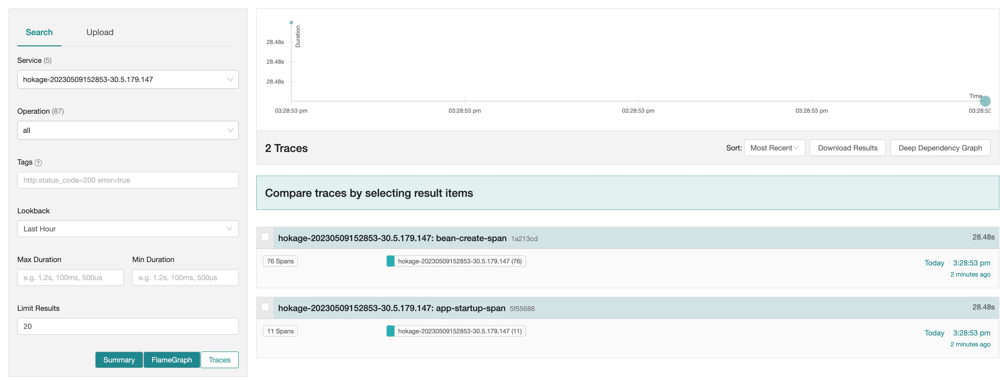
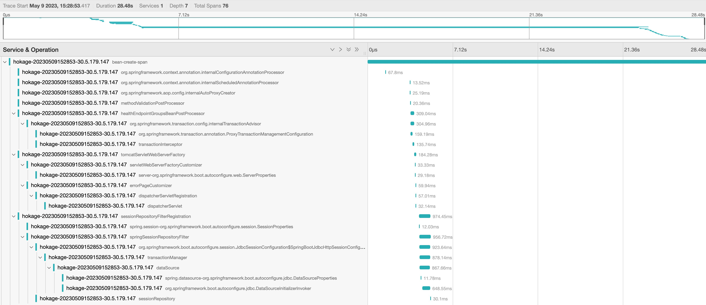
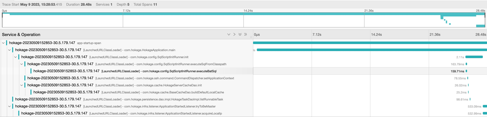
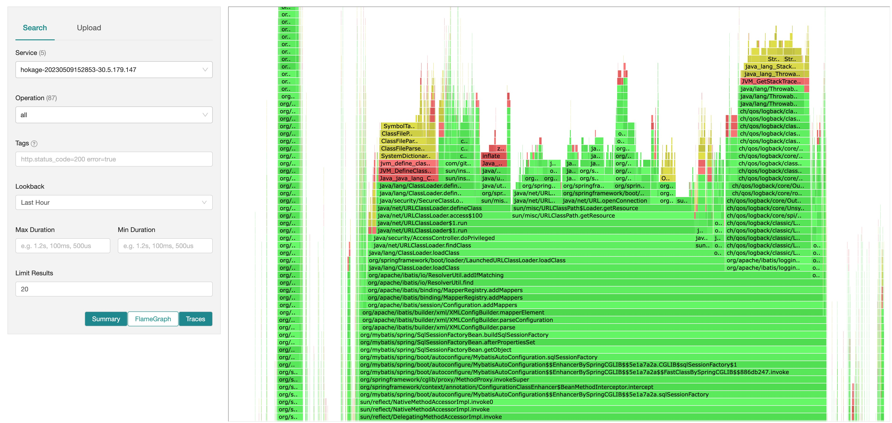
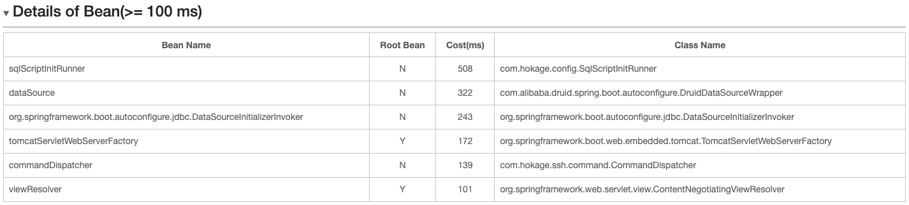
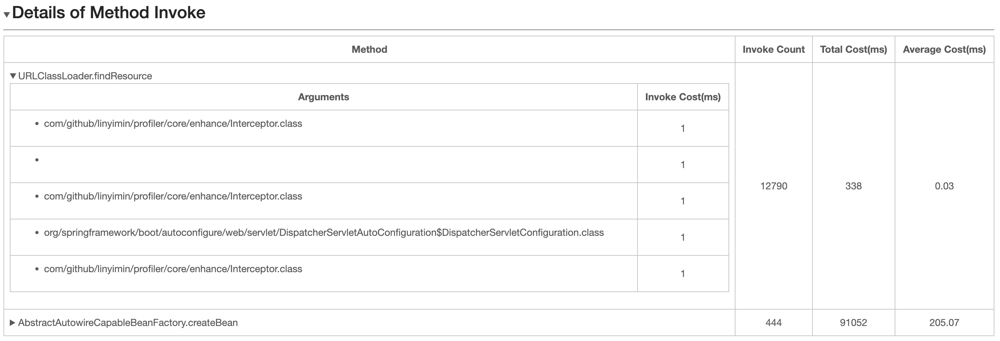
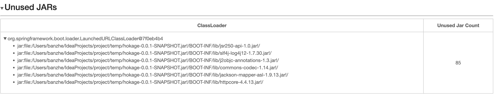
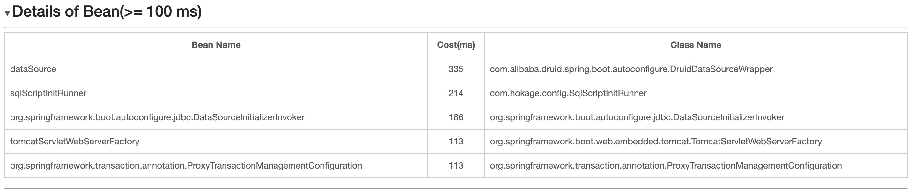

[](https://github.com/linyimin0812/java-profiler-boost)
[](https://search.maven.org/search?q=g:io.github.linyimin0812)
[](https://sonarcloud.io/project/overview?id=linyimin0812_java-profiler-boost)
[](https://sonarcloud.io/summary/new_code?id=linyimin0812_java-profiler-boost)
[](https://sonarcloud.io/summary/new_code?id=linyimin0812_java-profiler-boost)
[](https://sonarcloud.io/summary/new_code?id=linyimin0812_java-profiler-boost)
[](https://sonarcloud.io/summary/new_code?id=linyimin0812_java-profiler-boost)
[](https://sonarcloud.io/summary/new_code?id=linyimin0812_java-profiler-boost)

[中文](README_ZH.md) |
[ENGLISH](README.md)

# 1. Introduction

With the development of business, more and more JAR files are introduced into the application. Some fat JAR files have a size of more than 200MB, and the startup time is around 6-7 minutes, which seriously affects the response speed to online problems and also affects the development efficiency. It is necessary to optimize the startup time of the application. **No observation, no optimization**. This project implements the observation of the overall startup process of an application and provides some methods for optimizing startup time. It mainly includes the following capabilities.


## 1.1 Application startup data collection

<details open>
  <summary style='cursor: pointer'><strong>UI homepage</strong></summary>


</details>

<details>
  <summary style='cursor: pointer'><strong>timeline of Spring bean loading</strong></summary>


</details>

<details>
  <summary style='cursor: pointer'><strong>Call chain tracking</strong></summary>


</details>

<details>
  <summary style='cursor: pointer'><strong>Wall clock flame graph of application startup(supports specifying thread names)</strong></summary>


</details>

<details>
  <summary style='cursor: pointer'><strong>Loading time of Beans</strong></summary>


</details>

<details>
  <summary style='cursor: pointer'><strong>Method invocation count and time statistics (support for custom methods)</strong></summary>


</details>

<details>
  <summary style='cursor: pointer'><strong>Unloaded JAR files in the application (help with slimming down fat JAR)</strong></summary>



<strong>&emsp;It should be noted that some JAR files may be loaded at runtime. To remove JAR files that are not loaded at startup, it is important to perform thorough testing to avoid encountering ClassNotFoundException errors in production</strong>
</details>

<details open>
  <summary style='cursor: pointer'><strong>Support for custom extensions at the method/class/package</strong></summary>
    &emsp;&emsp;The system has reserved extension interfaces that can be implemented to achieve custom functionality extensions,<a href="#25-custom-extension">details</a>
</details>


## 1.2 Optimization of application startup time

<details open>
  <summary style='cursor: pointer'><strong>Asynchronous init method of Spring Bean</strong></summary>
    &emsp;&emsp;For beans with longer initialization time, execute the init and @PostConstruct methods asynchronously,<a href="#3-optimization-of-application-startup-time">details</a>
</details>


# 2. Application startup data collection

Because the project requires visualization of the Spring Bean initialization timeline and invocation relationships, we have chosen to report the data to [jaeger](https://www.jaegertracing.io/), for display in the Jaeger UI. Therefore, it is necessary to locally start Jaeger.

The collected data will be written to the `$HOME/java-profiler-boost/output/${appName}/${time}-${ip}-all.html` file. If Jaeger environment is not available (such as when the local machine is isolated from the staging environment and cannot access it), you can download this file to your local machine and open it using the Chrome browser to view the collected data. However, please note that this file does not include trace data.

## 2.1 start jaeger

```shell
docker run -d \
--name jaeger  \
-e COLLECTOR_ZIPKIN_HOST_PORT=:9411  \
-e COLLECTOR_OTLP_ENABLED=true  \
-p 6831:6831/udp  \
-p 6832:6832/udp  \
-p 5778:5778 \
-p 16686:16686 \
-p 4317:4317 \
-p 4318:4318 \
-p 14250:14250  \
-p 14268:14268 \
-p 14269:14269  \
-p 9411:9411 \
linyimin520812/all-in-one:v2.0.0
```

Accessing http://127.0.0.1:16686 successfully indicates that Jaeger has been started and is ready.

## 2.2 Installation

**1. Manual Installation**

1. Click [realease](https://github.com/linyimin-bupt/java-profiler-boost/releases/download/v1.0.0/java-profiler-boost.tar.gz) to download the latest version tar.gz package 


2. Create a new folder and extract the files

```shell
mkdir -p ${HOME}/java-profiler-boost
cd download_path
tar -zxvf java-profiler-boost.tar.gz ${HOME}/java-profiler-boost
```

**2. Shell script installation**

```shell
curl -sS https://raw.githubusercontent.com/linyimin-bupt/java-profiler-boost/main/bin/setup.sh | sh
```

## 2.3 Configuration

Configure the startup parameters, for example, to set the timeout to 30 minutes: `-Djava-profiler.app.status.check.timeout=30`

Please make sure to configure the `java-profiler.app.status.check.endpoints option`. Otherwise, the data collection will continue until the application startup check times out (default is 20 minutes). It will make a request to the endpoint every 1 second, and if the response header status code is 200, it will consider the application startup as completed.


| configuration option | description                           | default value                       |
| ---- | ----------- | ---------------------------- |
| java-profiler.app.status.check.timeout   | application startup check timeout time in minutes  | 20   |
| **java-profiler.app.status.check.endpoints**         | application startup success check URL(s), multiple URLs can be configured, separated by commas   | http://127.0.0.1:8080/actuator/health |
| java-profiler.jaeger.grpc.export.endpoint            | export endpoint of jaeger  | http://localhost:14250       |
| java-profiler.jaeger.ui.endpoint                     | UI endpoint of jaeger  | http://localhost:16686       |
| java-profiler.invoke.chain.packages                  | package name(s) for tracing method calls, multiple package names can be configured, separated by commas         | package of main class        |
| java-profiler.jaeger.span.min.sample.duration.millis | Minimum export time (in millis) for Jaeger spans | 10                           |
| java-profiler.admin.http.server.port                 | management port      | 8065                         |
| java-profiler.async.profiler.sample.thread.names     | thread names collected by Async Profiler, supports multiple configurations separated by commas | main                         |
| **java-profiler.async.profiler.interval.millis**     | async profiler sample interval (ms) | 5                            |
| java-profiler.spring.bean.init.min.millis            | Minimum time (in millis) for displaying a Bean in the statistics   | 100     |

## 2.4 Application Startup

This project is started as an agent, so you can add the parameter -javaagent:$HOME/java-profiler-boost/lib/java-profiler-agent.jar to the startup command. If you are starting the application using the java command line, add it to the command line. If you are starting it in IntelliJ IDEA, you need to add it to the VM options in the settings.

Path of logs：`$HOME/java-profiler-boost/logs`

- startup.log: log of startup
- transform.log: log of re-transform class

After the application has finished starting, the message ======= java-profiler-boost stop, click %s to view detailed info about the startup process ====== will be printed in the console and startup.log file. You can use this output to determine if the profiling has completed successfully

## 2.5 Custom extension

Translation: If you want to customize the profiling capabilities, you need to include the `java-profiler-starter` pom as the parent pom for your extension project. Then, you can use the interfaces exposed by the project for extension purposes. For more details, you can refer to the implementation of[java-profiler-extension](https://github.com/linyimin-bupt/java-profiler-boost/tree/main/java-profiler-extension)

```xml
<parent>
    <groupId>io.github.linyimin0812</groupId>
    <artifactId>java-profiler-starter</artifactId>
    <version>1.2.0</version>
</parent>
```

### 2.5.1 Extension Interfaces

<details>
<summary style='cursor: pointer'>io.github.linyimin0812.profiler.api.EventListener</summary>

```java
public interface EventListener extends Startable {

    /**
     * Invocation during application startup
     */
    void start();

    /**
     * Invocation after application startup completion
     */
    void stop();
    
    /**
     * class need to be enhance
     * @param className

     * @return true: enhance, false: not enhance
     */
    boolean filter(String className);

    /**
     * Methods to be enhanced (This method relies on the filter(className) condition. It will only be executed if filter(className) returns true.)
     * @param methodName
     * @param methodTypes
     * @return true: enhance, false: not enhance
     */
    default boolean filter(String methodName, String[] methodTypes) {
        return true;
    }

    /**
     * Event response processing logic
     * @param event fire  event
     */
    void onEvent(Event event);

    /**
     * events to listen
     * @return events need to be listened
     */
    List<Event.Type> listen();

}
```
</details>

The `start()` and `stop()` methods represent the lifecycle of the system, called respectively at the beginning and completion of application startup. The `filter()` method specifies the classes/methods that need to be enhanced. The `listen()` method specifies the events to listen for, including `method enter` and `method return` events. The `onEvent()` method is called when the listened events occur.

For example, the following is an extension that counts the number of invocations of the java.net.URLClassLoader.findResource(String) method during the application startup process:


<details>
    <summary style='cursor: pointer'>FindResourceCounter demo</summary>

```java
@MetaInfServices
public class FindResourceCounter implements EventListener {

    private final AtomicLong COUNT = new AtomicLong(0);

    @Override
    public boolean filter(String className) {
        return "java.net.URLClassLoader".equals(className);
    }

    @Override
    public boolean filter(String methodName, String[] methodTypes) {
       if (!"findResource".equals(methodName)) {
           return false;
       }

       return methodTypes != null && methodTypes.length == 1 && "java.lang.String".equals(methodTypes[0]);
    }

    @Override
    public void onEvent(Event event) {
        if (event instanceof AtEnterEvent) {
            // enter findResource method
        } else if (event instanceof AtExitEvent) {
            // findResource return
        }

        //  counts the number of invocations
        COUNT.incrementAndGet();

    }

    @Override
    public List<Event.Type> listen() {
        return Arrays.asList(Event.Type.AT_ENTER, Event.Type.AT_EXIT);
    }

    @Override
    public void start() {
        System.out.println("============== my extension start =============");
    }

    @Override
    public void stop() {
        System.out.println("============== my extension end =============");
        System.out.println("findResource count: " + COUNT.get());
    }
}
```
</details>

It is important to note that **the implementation of the EventListener interface should be annotated with @MetaInfServices**. This is because the extension interface is loaded through the Service Provider Interface (SPI). When you use the `@MetaInfServices` annotation, the implementation class will be automatically written to the `META-INF/services/io.github.linyimin0812.profiler.api.EventListener` file during the code compilation process. If you don't use the `@MetaInfServices` annotation, you need to manually write the fully qualified name of the implementation class into the META-INF/services/io.github.linyimin0812.profiler.api.EventListener file`. Otherwise, the extension implementation will not be loaded.

### 2.5.2 UI Extension Interfaces

After implementing an extension for a specific class/method, if you want to synchronize the statistical data to be displayed in the Jaeger UI, you can use the related UI interfaces. This project provides two types of interfaces:

**1. If you need to display the invocation relationships, you can use the Jaeger Tracer interface**

<details>
    <summary style='cursor: pointer'>UI format</summary>


</details>

```java
Jaeger jaeger = new Jaeger();
jaeger.start();

Tracer tracer = jaeger.createTracer("xxx-tracer");

Span span = tracer.spanBuilder("xxx-span").startSpan();

try (Scope scope = span.makeCurrent()) {

} finally {
span.end();
}

jaeger.stop();
```

**2. markdown content interface**

<details>
    <summary style='cursor: pointer'>UI format</summary>



</details>

```java
// markdown content, default order value is 100, the smaller the order, the higher the priority for display
MarkdownWriter.write(String content);
// specify order
MarkdownWriter.write(int order, String content);
```

**3. markdown statistics interfaces**

<details>
    <summary style='cursor: pointer'>UI format</summary>


</details>

```java
// markdown statistics, default order value is 100, the smaller the order, the higher the priority for display
MarkdownStatistics.write(String label, String value);
// specify order
MarkdownStatistics.write(int order, String label, String value);
```


### 2.5.3 Package & Run

The `java-profiler-starter` pom already defines a packaging plugin that will by default copy the generated JAR file to the `$HOME/java-profiler-boost/extension` directory.

```shell
mvn clean package
```

Once you have installed this project by following the steps in the [Installation](#22-Installation) section, you can execute the packaging command mentioned above. After the packaging is complete, you can start the application as described in the [Application Startup](#24-application-startup) section to load the extension JAR file.

# 3. Optimization of application startup time

<!--  -->

 From the [Application startup data collection](#2-application-startup-data-collection)section, you can obtain the Beans that have long initialization time. Since the Spring startup process is single-threaded, to optimize the application startup time, you can consider making the initialization methods of these time-consuming Beans asynchronous. You can refer to the [Implementation Principle](./HOW_IT_WORKS_EN.md) section for details on how it works.


NOTE:

- **It is advisable to prioritize optimizing the code of Beans to fundamentally address the issue of long initialization time**
- **For Beans with long initialization time in second-party or third-party packages (where code optimization is not possible), consider asynchronous initialization of those Beans.**
- **For Beans that are not dependent on other Beans, you can confidently proceed with asynchronous initialization**，You can determine if a Bean is dependent on other Beans by examining the `Root Bean` in  [Loading time of Beans](#11-application-startup-data-collection) session
- **Careful analysis is required for Beans that are dependent on other Beans. They should not be called by other Beans during the application startup process, as it may lead to issues**

## 3.1 Types of Bean for Async

Supports initialization of beans through @Bean, @PostConstruct, and @ImportResource. demo: [spring-boot-async-bean-demo](https://github.com/linyimin0812/spring-boot-async-bean-demo)

1. Bean annotated with `@Bean(initMethod = "init")`

```java
@Bean(initMethod = "init")
public TestBean testBean() {
    return new TestBean();
}
```

2. Bean annotated with `@PostConstruct`


```java
@Component
public class TestComponent {
    @PostConstruct
    public void init() throws InterruptedException {
        Thread.sleep(20 * 1000);
    }
}
```


## 3.2 Usage

1. Import Dependency

```xml
<dependency>
    <groupId>io.github.linyimin0812</groupId>
    <artifactId>spring-async-bean-starter</artifactId>
    <version>1.2.0</version>
</dependency>
```

2. Configuration

```properties
# Asynchronous beans may be at the end of the Spring bean initialization order, which may result in suboptimal effects of asynchronous optimization. Open the configuration to prioritize loading asynchronous beans.
java.profiler.boost.spring.async.bean-priority-load-enable=true
# name of bean to async init
java.profiler.boost.spring.async.bean-names=testBean,testComponent
# init bean thread pool core size
java.profiler.boost.spring.async.init-bean-thread-pool-core-size=8
# init bean thread pool max size
java.profiler.boost.spring.async.init-bean-thread-pool-max-size=8
```

3. Check if the bean is initialized asynchronously

View the log in the $HOME/java-profiler-boost/logs/startup.log file. For asynchronously initialized methods, a log entry will be written in the following format:

```
async-init-bean, beanName: ${beanName}, async init method: ${initMethodName}
```

# 4. Future Plans

Currently, the observation of the application startup process has been completed, which allows us to identify bottlenecks during the startup. Therefore, the next step is to provide a set of solutions for common bottlenecks, such as:

- [ ] Jar Index


# 5. Contribute to the project.

[CONTRIBUTING](./CONTRIBUTING.md) 


# 6. 🙏Thank you for your support

If this project has been helpful to you, please consider giving it a star⭐️
