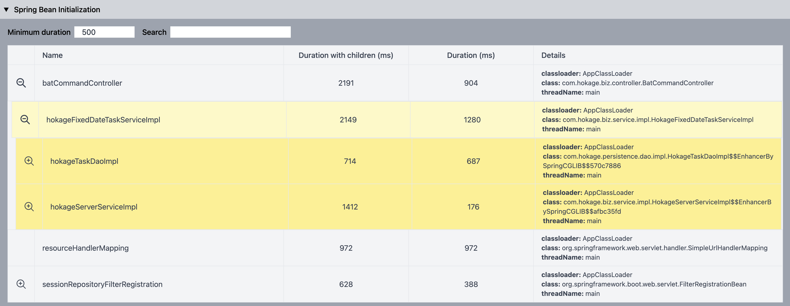
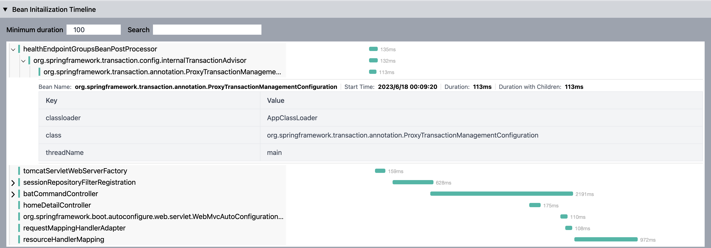
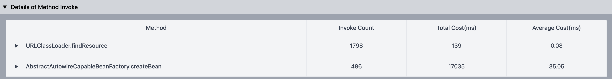
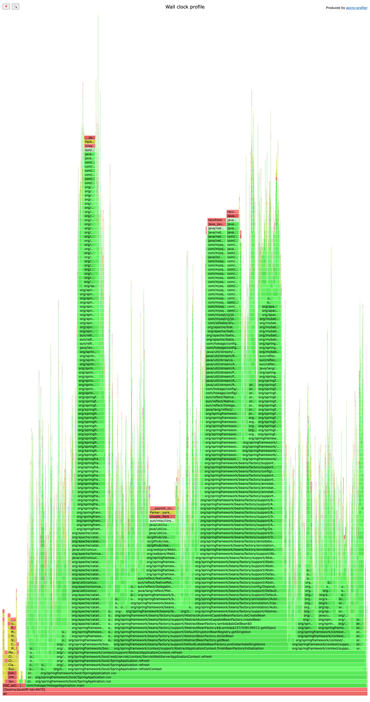
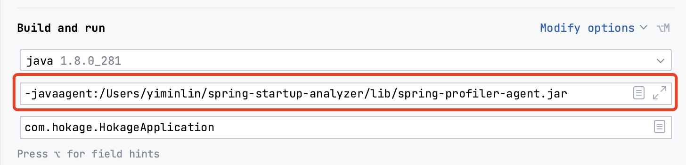
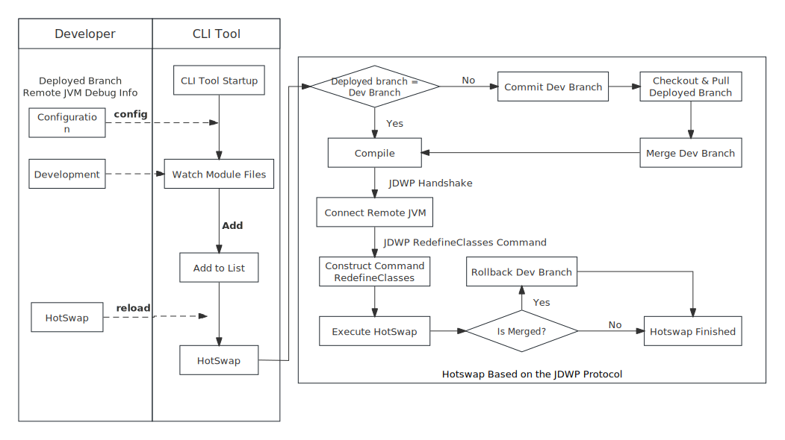

[](https://github.com/linyimin0812/spring-startup-analyzer)
[](https://search.maven.org/search?q=g:io.github.linyimin0812)
[](https://sonarcloud.io/summary/new_code?id=linyimin0812_spring-startup-analyzer)
[](https://github.com/linyimin0812/spring-startup-analyzer/releases)


[ENGLISH](README.md) |
[中文](README_ZH.md)

- [🤩Highlight](#highlight)
  - [📈Spring Startup Analysis Report](#spring-startup-analysis-report)
  - [🚀Optimization of Spring Startup](#optimization-of-spring-startup)
- [🧭How to Use](#how-to-use)
    - [📈Spring Startup Data Collection](#spring-startup-data-collection)
        - [Installation](#installation)
        - [Configuration](#configuration)
        - [Application Startup](#application-startup)
        - [Custom extension](#custom-extension)
    - [🚀Optimization of Spring Startup](#optimization-of-spring-startup-1)
        - [Optimization of Prod Env Startup Time](#optimization-of-prod-env-startup-time)
            - [Types of Bean for Async](#types-of-bean-for-async)
            - [Usage](#usage)
        - [Optimization of Daily and Pre Env Startup Time](#optimization-of-daily-and-pre-env-startup-time)
- [🔗Reference](#Reference)

# Spring Startup Analyzer

**Spring Startup Analyzer** generates an interactive Spring application startup report that lets you understand what contributes to the application startup time and helps to optimize it. UI referenced [spring-boot-startup-report](https://github.com/maciejwalkowiak/spring-boot-startup-report).

[analyzer report demo](https://linyimin-blog.oss-cn-beijing.aliyuncs.com/spring-satrtup-analyzer/hokage-20230618000928-192.168.0.101-analyzer.html)

# 🤩Highlight

## 📈Spring Startup Analysis Report

**Spring Bean Initialization Details** support for initialization time/beanName search, **Spring Bean Initialization Timeline**, **Method Invocation Count and Time Statistics**(support for custom methods), **Unused Jars**(to help optimize fat jars), and **Application Startup Thread Wall Clock Profile**, helping developers quickly analyze and locate application startup bottlenecks. Support for linux/mac/windows.

- **Spring Bean Initialization Details**
  


- **Spring Bean Initialization Timeline**
  


- **Method Invocation Count and Time Statistics**
  


- **Unused Jars**
  

- **Application Startup Thread Wall Clock Profile**
  


## 🚀Optimization of Spring Startup

Provide a Spring Bean asynchronous initialization jar package, which asynchronously executes the `init` and `@PostConstruct` methods for beans with longer initialization time to improve application startup speed.

# 🧭How to Use

## 📈Spring Startup Data Collection


### Installation

Provides two installation methods: **manual installation** and **one-click script installation**.

**1. Manual Installation**

1. Click [realease](https://github.com/linyimin0812/spring-startup-analyzer/releases/download/v3.0.0/spring-startup-analyzer.tar.gz) to download the latest version tar.gz package

2. Create a new folder and extract the files

For **Linux/Mac** systems, you may consider utilizing the following commands:

```shell
mkdir -p ${HOME}/spring-startup-analyzer
cd download_path
tar -zxvf spring-startup-analyzer.tar.gz -C your_install_path/spring-startup-analyzer
```

**2. Shell script installation(Only for Linux/Mac)**

```shell
curl -sS https://raw.githubusercontent.com/linyimin0812/spring-startup-analyzer/main/bin/install.sh | sh
```

Default install directory: `$HOME/spring-startup-analyzer`

### Configuration

This project provides several configuration options, which are not mandatory and can be used with default settings.

Two ways to configure:

1. Directly configure in the configuration file: `your_install_path/spring-startup-analyzer/config/spring-startup-analyzer.properties`
2. Configure through startup parameters, for example, set the application startup health check timeout to 30 minutes: `-Dspring-startup-analyzer.app.health.check.timeout=30`

The criteria for determining a successful application startup are as follows:

1. Bytecode enhancement on the `SpringApplication.run` method, considering the application startup complete upon method exit (only applicable to Spring Boot applications).
2. Polling the URL for health check requests, considering the startup complete upon receiving a 200 response (applicable to all Spring applications).
3. If neither of the above two methods succeeds, considering the application startup complete after exceeding the **application startup health check timeout**.

For non-Spring Boot applications, it is necessary to configure the health check URL using `spring-startup-analyzer.app.health.check.endpoints`.


| configuration option                                       | description                                                                                    | default value                         |
|------------------------------------------------------------|------------------------------------------------------------------------------------------------|---------------------------------------|
| spring-startup-analyzer.app.health.check.timeout           | application startup check timeout time in minutes                                              | 20                                    |
| **spring-startup-analyzer.app.health.check.endpoints**     | application startup success check URL(s), multiple URLs can be configured, separated by commas | http://127.0.0.1:7002/actuator/health |
| spring-startup-analyzer.admin.http.server.port             | management port                                                                                | 8065                                  |
| spring-startup-analyzer.async.profiler.sample.thread.names | thread names collected by Async Profiler, supports multiple configurations separated by commas | main                                  |
| **spring-startup-analyzer.async.profiler.interval.millis** | async profiler sample interval (ms)                                                            | 5                                     |
| spring-startup-analyzer.linux.and.mac.profiler             | specify linux/mac flame graph profiler：async_profiler/jvm_profiler                             | jvm_profiler                          |
| spring-startup-analyzer.log.path                           | Path of logs<br/>- startup.log: log of startup<br/>- transform.log: log of re-transform class  | $HOME/spring-startup-analyzer/logs    |


### Application Startup

This project is started as an agent, so you can add the parameter `-javaagent:your_install_path/spring-startup-analyzer/lib/spring-profiler-agent.jar` to the startup command.


- To start the application using the Java command line, you would add parameters in the command line, for example:

```shell
java -javaagent:/Users/runner/spring-startup-analyzer/lib/spring-profiler-agent.jar \
    -Dproject.name=mac-demo \
    -Dspring-startup-analyzer.admin.http.server.port=8066 \
    -jar /Users/runner/spring-startup-analyzer/spring-boot-demo.jar
```

- If you want to launch in IDEA, you need to add the following in the VM options:




After the application has finished starting, the message `======= spring-startup-analyzer finished, click http://localhost:xxxx to visit details. ======` will be printed in the console and startup.log file. You can use this output to determine if the profiling has completed successfully

### Custom extension

Translation: If you want to customize the profiling capabilities, you need to include the `spring-profiler-starter` pom as the parent pom for your extension project. Then, you can use the interfaces exposed by the project for extension purposes. For more details, you can refer to the implementation of[spring-profiler-extension](https://github.com/linyimin-bupt/spring-startup-analyzer/tree/main/spring-profiler-extension)

```xml
<parent>
    <groupId>io.github.linyimin0812</groupId>
    <artifactId>spring-profiler-starter</artifactId>
    <version>latest_version</version>
</parent>
```

#### Extension Interfaces

<details>
<summary style='cursor: pointer'>io.github.linyimin0812.profiler.api.EventListener</summary>

```java
public interface EventListener extends Startable {

    /**
     * Invocation during application startup
     */
    void start();

    /**
     * Invocation after application startup completion
     */
    void stop();
    
    /**
     * class need to be enhance
     * @param className

     * @return true: enhance, false: not enhance
     */
    boolean filter(String className);

    /**
     * Methods to be enhanced (This method relies on the filter(className) condition. It will only be executed if filter(className) returns true.)
     * @param methodName
     * @param methodTypes
     * @return true: enhance, false: not enhance
     */
    default boolean filter(String methodName, String[] methodTypes) {
        return true;
    }

    /**
     * Event response processing logic
     * @param event fire  event
     */
    void onEvent(Event event);

    /**
     * events to listen
     * @return events need to be listened
     */
    List<Event.Type> listen();

}
```
</details>

The `start()` and `stop()` methods represent the lifecycle of the system, called respectively at the beginning and completion of application startup. The `filter()` method specifies the classes/methods that need to be enhanced. The `listen()` method specifies the events to listen for, including `method enter` and `method return` events. The `onEvent()` method is called when the listened events occur.

For example, the following is an extension that counts the number of invocations of the java.net.URLClassLoader.findResource(String) method during the application startup process:


<details>
    <summary style='cursor: pointer'>FindResourceCounter demo</summary>

```java
@MetaInfServices
public class FindResourceCounter implements EventListener {

    private final AtomicLong COUNT = new AtomicLong(0);

    @Override
    public boolean filter(String className) {
        return "java.net.URLClassLoader".equals(className);
    }

    @Override
    public boolean filter(String methodName, String[] methodTypes) {
       if (!"findResource".equals(methodName)) {
           return false;
       }

       return methodTypes != null && methodTypes.length == 1 && "java.lang.String".equals(methodTypes[0]);
    }

    @Override
    public void onEvent(Event event) {
        if (event instanceof AtEnterEvent) {
            // enter findResource method
        } else if (event instanceof AtExitEvent) {
            // findResource return
        }

        //  counts the number of invocations
        COUNT.incrementAndGet();

    }

    @Override
    public List<Event.Type> listen() {
        return Arrays.asList(Event.Type.AT_ENTER, Event.Type.AT_EXIT);
    }

    @Override
    public void start() {
        System.out.println("============== my extension start =============");
    }

    @Override
    public void stop() {
        System.out.println("============== my extension end =============");
        System.out.println("findResource count: " + COUNT.get());
    }
}
```
</details>

It is important to note that **the implementation of the EventListener interface should be annotated with @MetaInfServices**. This is because the extension interface is loaded through the Service Provider Interface (SPI). When you use the `@MetaInfServices` annotation, the implementation class will be automatically written to the `META-INF/services/io.github.linyimin0812.profiler.api.EventListener` file during the code compilation process. If you don't use the `@MetaInfServices` annotation, you need to manually write the fully qualified name of the implementation class into the META-INF/services/io.github.linyimin0812.profiler.api.EventListener file`. Otherwise, the extension implementation will not be loaded.


#### Package & Run

The `spring-profiler-starter` pom already defines a packaging plugin that will by default copy the generated JAR file to the `$HOME/spring-startup-analyzer/extension` directory.

```shell
mvn clean package
```

Once you have installed this project by following the steps in the [Installation](#22-Installation) section, you can execute the packaging command mentioned above. After the packaging is complete, you can start the application as described in the [Application Startup](#24-application-startup) section to load the extension JAR file.

## 🚀Optimization of Spring Startup

### Optimization of Prod Env Startup Time

From the [Application startup data collection](#spring-startup-analysis-report)section, you can obtain the Beans that have long initialization time. Since the Spring startup process is single-threaded, to optimize the application startup time, you can consider making the initialization methods of these time-consuming Beans asynchronous.


NOTE:

- **It is advisable to prioritize optimizing the code of Beans to fundamentally address the issue of long initialization time**
- **For Beans with long initialization time in second-party or third-party packages (where code optimization is not possible), consider asynchronous initialization of those Beans.**
- **For Beans that are not dependent on other Beans, you can confidently proceed with asynchronous initialization**，You can determine if a Bean is dependent on other Beans by examining the `Root Bean` in  [Loading time of Beans](#11-application-startup-data-collection) session
- **Careful analysis is required for Beans that are dependent on other Beans. They should not be called by other Beans during the application startup process, as it may lead to issues**

#### Types of Bean for Async

Supports initialization of beans through @Bean, @PostConstruct, and @ImportResource. demo: [spring-boot-async-bean-demo](https://github.com/linyimin0812/spring-boot-async-bean-demo)

1. Bean annotated with `@Bean(initMethod = "init")`

```java
@Bean(initMethod = "init")
public TestBean testBean() {
    return new TestBean();
}
```

2. Bean annotated with `@PostConstruct`


```java
@Component
public class TestComponent {
    @PostConstruct
    public void init() throws InterruptedException {
        Thread.sleep(20 * 1000);
    }
}
```


#### Usage

1. Import Dependency

```xml
<dependency>
    <groupId>io.github.linyimin0812</groupId>
    <artifactId>spring-async-bean-starter</artifactId>
    <version>${latest_version}</version>
</dependency>
```

2. Configuration

```properties
# Asynchronous beans may be at the end of the Spring bean initialization order, which may result in suboptimal effects of asynchronous optimization. Open the configuration to prioritize loading asynchronous beans.
spring-startup-analyzer.boost.spring.async.bean-priority-load-enable=true
# name of bean to async init
spring-startup-analyzer.boost.spring.async.bean-names=testBean,testComponent
# init bean thread pool core size
spring-startup-analyzer.boost.spring.async.init-bean-thread-pool-core-size=8
# init bean thread pool max size
spring-startup-analyzer.boost.spring.async.init-bean-thread-pool-max-size=8
```

3. Check if the bean is initialized asynchronously

View the log in the `$HOME/spring-startup-analyzer/logs/async-init-bean.log` file. For asynchronously initialized methods, a log entry will be written in the following format:

```
async-init-bean, beanName: ${beanName}, async init method: ${initMethodName}
```

### Optimization of Daily and Pre Env Startup Time

To optimize the startup time for daily and pre, we can consider hotswap. The project provides a command-line tool to implement hotswap for modified code.



1. Download `spring-startup-cli` from [release](https://github.com/linyimin0812/spring-startup-analyzer/releases/tag/v3.0.0)
2. Execute the command-line tool in the project's working directory

```shell
java -jar spring-startup-cli.jar
```

3. Configure information using `config` command.

```shell
config set
```

4. Execute `reload` command 

# 🔗Reference
- [arthas](https://github.com/alibaba/arthas)
- [jvm-sandbox](https://github.com/alibaba/jvm-sandbox)
- [async-profiler](https://github.com/async-profiler/async-profiler)
- [启动加速-异步初始化方法](https://help.aliyun.com/document_detail/133162.html)
- [spring-boot-startup-report](https://github.com/maciejwalkowiak/spring-boot-startup-report)
- [一些可以显著提高 Java 启动速度方法](https://heapdump.cn/article/4136322)
- [jaeger-ui](https://github.com/jaegertracing/jaeger-ui)
