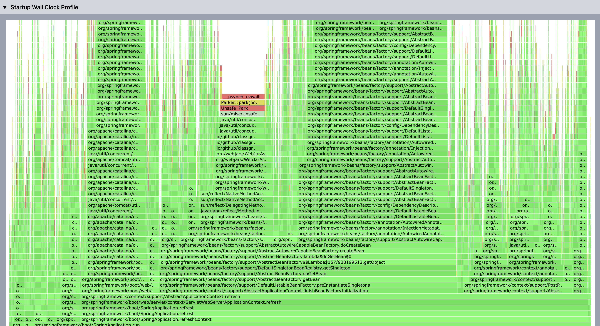

[](https://github.com/linyimin0812/spring-startup-analyzer)
[](https://search.maven.org/search?q=g:io.github.linyimin0812)
[](https://sonarcloud.io/project/overview?id=linyimin0812_spring-startup-analyzer)
[](https://sonarcloud.io/summary/new_code?id=linyimin0812_spring-startup-analyzer)
[](https://sonarcloud.io/summary/new_code?id=linyimin0812_spring-startup-analyzer)
[](https://sonarcloud.io/summary/new_code?id=linyimin0812_spring-startup-analyzer)
[](https://sonarcloud.io/summary/new_code?id=linyimin0812_spring-startup-analyzer)
[](https://sonarcloud.io/summary/new_code?id=linyimin0812_spring-startup-analyzer)

[中文](README.md) |
[ENGLISH](README_EN.md)


- [🤩核心能力](#核心能力)
  - [📈Spring应用启动数据采集报告](#spring应用启动数据采集报告)
  - [🚀应用启动时长优化](#应用启动时长优化)
- [📈Spring应用启动数据采集报告](#spring应用启动数据采集报告-1)
  - [安装jar包](#安装jar包)
  - [配置项](#配置项)
  - [应用启动](#应用启动)
  - [自定义扩展](#自定义扩展)
- [🚀应用启动时长优化](#应用启动时长优化-1)
  - [支持异步化的Bean类型](#支持异步化的bean类型)
  - [接入异步Bean优化](#接入异步bean优化)
    

# Spring Startup Ananlyzer

**Spring Startup Ananlyzer** 采集Spring应用启动过程数据，生成交互式分析报告([HTML](https://linyimin-blog.oss-cn-beijing.aliyuncs.com/spring-satrtup-analyzer/hokage-20230618000928-192.168.0.101-analyzer.html))，用于分析Spring应用启动卡点，优化Spring应用启动速度。

[analyzer report demo](https://linyimin-blog.oss-cn-beijing.aliyuncs.com/spring-satrtup-analyzer/hokage-20230618000928-192.168.0.101-analyzer.html)

# 🤩核心能力

## 📈Spring应用启动数据采集报告

**Spring Bean初始化详情信息**，支持初始化耗时/beanName搜索、**Spring Bean初始化时序图**、**方法调用次数及耗时统计**(支持自定义方法)、**应用未加载的jar包**(帮助fatjar瘦身)及**应用启动过程线程wall clock火焰图**，帮助开发者快速分析定位应用启动卡点

- Spring Bean初始化详情


- Spring Bean初始化时序图


- 方法调用次数、耗时统计(支持自定义方法)


- 应用未加载的jar包(帮助fatjar瘦身)


- 应用启动过程线程wall clock火焰图(支持指定线程名称，不指定则采集全部线程)


## 🚀应用启动时长优化

提供一个Spring Bean异步初始化jar包，针对初始化耗时比较长的bean，异步执行init和@PostConstruct方法提高应用启动速度。

# 📈Spring应用启动数据采集报告

## 安装jar包

提供了**手动安装**和**一键脚本安装**两种安装方式

**1. 手动安装**

1. 点击[realease](https://github.com/linyimin0812/spring-startup-analyzer/releases/download/v2.0.0/spring-startup-analyzer.tar.gz)下载最新版tar.gz包
2. 新建文件夹，并解压

```shell
mkdir -p ${HOME}/spring-startup-analyzer
cd 下载路径
tar -zxvf spring-startup-analyzer.tar.gz ${HOME}/spring-startup-analyzer
```

**2. 脚本安装**

```shell
curl -sS https://raw.githubusercontent.com/linyimin0812/spring-startup-analyzer/main/bin/install.sh | sh
```

## 配置项

在启动参数中进行配置，如配置超时时间为30分钟：`-Dspring-startup-analyzer.app.health.check.timeout=30`

请务必配置`spring-startup-analyzer.app.health.check.endpoints`选项，不然会一直采集直到应用启动检查超时时间(默认20分钟)才会停止，每隔1秒请求一次endpoint，请求响应头状态码为200则认为应用启动完成。默认健康检查URL：`http://127.0.0.1:7002/actuator/health`


| 配置项                                               | 说明                                    | 默认值                                   |
| ---------------------------------------------------- |---------------------------------------|---------------------------------------|
| spring-startup-analyzer.app.health.check.timeout               | 应用启动健康检查超时时间，单位为分钟                    | 20 |
| **spring-startup-analyzer.app.health.check.endpoints**         | 应用启动成功检查url，可配置多个，以","分隔              | http://127.0.0.1:7002/actuator/health |
| spring-startup-analyzer.admin.http.server.port                 | 管理端口                                  | 8065            |
| spring-startup-analyzer.async.profiler.sample.thread.names     | async profiler采集的线程名称，支持配置多个，以","进行分隔 | main |
| **spring-startup-analyzer.async.profiler.interval.millis**     | async profiler采集间隔时间(ms)              | 5       |

## 应用启动

此项目是以agent的方式启动的，所以在启动命令中添加参数`-javaagent:$HOME/spring-startup-analyzer/lib/spring-profiler-agent.jar`即可。如果是以java命令行的方式启动应用，则在命令行中添加，如果是在IDEA中启动，则需要在VM options选项中添加。

日志文件路径：`$HOME/spring-startup-analyzer/logs`

- startup.log: 启动过程中的日志
- transform.log: 被re-transform的类/方法信息

应用启动完成后会在console和startup.log文件中输出`======= spring-startup-analyzer finished, click http://localhost:8065 to visit details. ======`，可以通过此输出来判断采集是否完成。

## 自定义扩展

如果需要自定义观测能力，需要引入`spring-profiler-starter`的pom作为扩展项目的父pom，然后就可以使用项目对外暴露的接口进行扩展。更多的细节可以参考[spring-profiler-extension](https://github.com/linyimin-bupt/spring-startup-analyzer/tree/main/spring-profiler-extension)的实现

```xml
<parent>
    <groupId>io.github.linyimin0812</groupId>
    <artifactId>spring-profiler-starter</artifactId>
    <version>2.0.0</version>
</parent>
```

### 扩展接口

<details>
<summary style='cursor: pointer'>io.github.linyimin0812.profiler.api.EventListener</summary>

```java
public interface EventListener extends Startable {

    /**
     * 应用启动时调用
     */
    void start();

    /**
     * 应用启动完成后调用
     */
    void stop();
    
    /**
     * 需要增强的类
     * @param className 类全限定名, 如果为空, 默认返回为true

     * @return true: 进行增强, false: 不进行增强
     */
    boolean filter(String className);

    /**
     * 需要增强的方法(此方法会依赖filter(className), 只有filter(className)返回true时，才会执行到此方法)
     * @param methodName 方法名
     * @param methodTypes 方法参数列表
     * @return true: 进行增强, false: 不进行增强
     */
    default boolean filter(String methodName, String[] methodTypes) {
        return true;
    }

    /**
     * 事件响应处理逻辑
     * @param event 触发的事件
     */
    void onEvent(Event event);

    /**
     * 监听的事件
     * @return 需要监听的事件列表
     */
    List<Event.Type> listen();

}
```
</details>

其中`start()和stop()`方法代表系统的生命周期，分别在应用开始启动和应用启动完成时调用。`filter()`方法指定需要增强的类/方法。`listen()`方法指定监听的事件，包括`进入方法`和`方法返回`两种事件。`onEvent()`方法在监听的事件发生时会被调用

例如下面是一个统计应用启动过程中java.net.URLClassLoader.findResource(String)方法调用次数的扩展

<details>
    <summary style='cursor: pointer'>FindResourceCounter demo</summary>

```java
@MetaInfServices
public class FindResourceCounter implements EventListener {

    private final AtomicLong COUNT = new AtomicLong(0);

    @Override
    public boolean filter(String className) {
        return "java.net.URLClassLoader".equals(className);
    }

    @Override
    public boolean filter(String methodName, String[] methodTypes) {
       if (!"findResource".equals(methodName)) {
           return false;
       }

       return methodTypes != null && methodTypes.length == 1 && "java.lang.String".equals(methodTypes[0]);
    }

    @Override
    public void onEvent(Event event) {
        if (event instanceof AtEnterEvent) {
            // 开始进入findResource方法
        } else if (event instanceof AtExitEvent) {
            // findResource方法返回
        }

        // 统计调用次数
        COUNT.incrementAndGet();

    }

    @Override
    public List<Event.Type> listen() {
        return Arrays.asList(Event.Type.AT_ENTER, Event.Type.AT_EXIT);
    }

    @Override
    public void start() {
        System.out.println("============== my extension start =============");
    }

    @Override
    public void stop() {
        System.out.println("============== my extension end =============");
        System.out.println("findResource count: " + COUNT.get());
    }
}
```
</details>

### 打包运行

在`spring-profiler-starter`的pom中已经定义了打包plugin，默认会将生成的jar包拷贝到`$HOME/spring-startup-analyzer/extension`文件下。

```shell
mvn clean package
```

只要按照步骤[安装jar包](#22-安装jar包)安装好此项目，再执行上述的打包命令，打包好后再[启动应用](#24-应用启动)即可加载扩展jar包。

# 🚀应用启动时长优化

从[应用启动数据采集](#2-应用启动数据采集)中，可以获取初始化耗时长的Bean，因为Spring启动过程是单线程完成的，为了优化应用的启动时长，可以考虑将这些耗时长的Bean的初始化方法异步化，查看[实现原理](./HOW_IT_WORKS.md#spring-bean异步加载原理)。

需要注意：

- **应该优先从代码层面优化初始化时间长的Bean，从根本上解决Bean初始化耗时长问题**
- **对于二方包/三方包中初始化耗时长的Bean(无法进行代码优化)再考虑Bean的异步化**
- **对于不被依赖的Bean可以放心进行异步化**，可以通过[各个Bean加载耗时](#11-应用启动数据采集)中的`Root Bean`判断Bean是否被其他Bean依赖
- **对于被依赖的Bean需要小心分析，在应用启动过程中不能其他Bean被调用，否则可能会存在问题**

## 支持异步化的Bean类型

支持@Bean, @PostConstruct及@ImportResource 方式初始化bean，使用demo: [spring-boot-async-bean-demo](https://github.com/linyimin0812/spring-boot-async-bean-demo)

1. `@Bean(initMethod = "init")`标识的Bean

```java
@Bean(initMethod = "init")
public TestBean testBean() {
    return new TestBean();
}
```

2. `@PostConstruct`标识的Bean


```java
@Component
public class TestComponent {
    @PostConstruct
    public void init() throws InterruptedException {
        Thread.sleep(20 * 1000);
    }
}
```


## 接入异步Bean优化

1. 添加pom依赖

```xml
<dependency>
    <groupId>io.github.linyimin0812</groupId>
    <artifactId>spring-async-bean-starter</artifactId>
    <version>2.0.0</version>
</dependency>
```

2. 配置一步加载信息

```properties
# 异步化的Bean可能在Spring Bean初始化顺序的末尾，导致异步优化效果不佳，打开配置优先加载异步化的Bean
spring-startup-analyzer.boost.spring.async.bean-priority-load-enable=true
# 指定异步的Bean名称
spring-startup-analyzer.boost.spring.async.bean-names=testBean,testComponent
# 执行异步化Bean初始化方法线程池的核心线程数
spring-startup-analyzer.boost.spring.async.init-bean-thread-pool-core-size=8
# 执行异步化Bean初始化方法线程池的最大线程数
spring-startup-analyzer.boost.spring.async.init-bean-thread-pool-max-size=8
```

3. 检查Bean是否异步初始化

查看日志`$HOME/spring-startup-analyzer/logs/startup.log`文件，对于异步执行初始化的方法，会按照以下格式写一条日志:

```
async-init-bean, beanName: ${beanName}, async init method: ${initMethodName}
```

